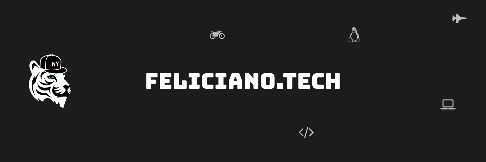

# Welcome to my GitHub

Hey, my name is Ricardo N Feliciano though you'll usually find me by `FelicianoTech` around the Internet.
You can learn more about me on my [personal website](https://www.feliciano.tech) or you can get a quick summary below.

 

	&nbsp;&nbsp;&nbsp;
	&nbsp;&nbsp;&nbsp;
	&nbsp;&nbsp;&nbsp;
	&nbsp;&nbsp;&nbsp;&nbsp;&nbsp;

## About Me

:technologist: I current work at [CircleCI](https://circleci.com), managing the Developer Resources & Engineering (DRE) team.  
:green_heart: My core passions in tech are open source, documentation, and community.  
:us: U.S. Navy veteran  
:family_man_woman_girl_boy: My wife, two kids, and I have made our home in central Florida, United States.

## My Projects

I have some open source projects under my personal namespace here, but I also do work under these other namespaces:

- [HubCI](https://github.com/hubci)
- [GopherLibs](https://github.com/gopherlibs)
- [CloudUnpacked](https://github.com/cloud-unpacked)
